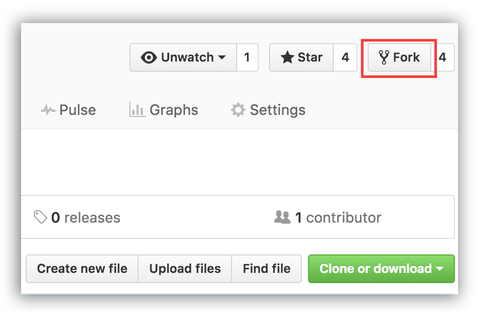

# **CONTRIBUTION**

If you are looking to make your first contribution, just follow this simplest guidelinex

If you don't have git on your machine, [install it](https://help.github.com/articles/set-up-git/).

#

## **TABLE OF CONTENT**

1. Fork
2. Clone
3. Create a branch
4. Make changes
5. Commit and push
6. Create a pull request

#

## **Fork**

Before forking a repository you have to go to the repository's main page and click on the fork button, on the right-hand side. Figure 1 illustrates what you should see.

<figure>
    
    <figcaption>Figure 1</figcaption>
</figure>

Once you click the button, GitHub redirects you to your copy of the original repo

#

## **Clone**

Now clone this repo to your machine. Go to your GitHub account, click on the clone button and then click the _copy to clipboard_ icon.

<figure>
    
    <figcaption>Figure 2</figcaption>
</figure>

Then you need to copy the link as shown on figure 2, and run the following command on your machine:

```
git clone https://github.com/<profile_name>/<repo_name>.git
```

#

## **Create a branch**

Before making and pushing any changes, you have to create a branch to hold all your changes.

Create a branch by running the following Git command:

```
git checkout -b "branch_name"
```

_NB: Use your ***USERNAME*** to name your branch._

#

## **Make changes or add contribution and then commit**

You can make code changes, update the documentation, organize the files, or anything else. Always remember that all contributions are important. Whether you add a new feature or fix errors in the documentation, both are important and valuable

#

## **Commit and push**

First of all, run

```
git status
```

To see which files you modified. Once you see the files changed, and after you decide what you want to commit, run the following command:

```
git add .
```

To add all the files

**OR**

To specify which files to add use the command

```
git add file_name file_name
```

Commit your changes or contributions. **_Commit_messsage_** should be a small description of what you did on the repository. Use the following command to commit.

**_NB:_** _Don't remove the quotation marks and try to use meaningful commit messsage_

```
git commit -m "Commit_message"
```

Now you need to push. To push your changes use the command

```
git push origin branch_name
```

_NB: ***branch_name*** is the branch you created earlier._

#

## **Create a pull request**

Usually, after pushing your changes, you get a link you can click to open a pull request automatically.

If that does not happen, you can go to the repo and click on Compare & pull request. You can see an example in figure 3

<figure>
    
    <figcaption>Figure 3</figcaption>
</figure>

By clicking on Compare & pull request, a new window opens where you can enter a title and a description for your pull request. Figure 4 illustrates an example of a simple pull request

<figure>
    
    <figcaption>Figure 4</figcaption>
</figure>

After adding all the necessary information, click the button saying "Create Pull Request". Congratulations! You made your changes and opened a pull request.

#

## **Conclusion**

This explains the most straightforward workflow to make contributions to open source projects.

Personally I have used this workflow to make changes successfully to **DEV NATION**, which is open-source.
